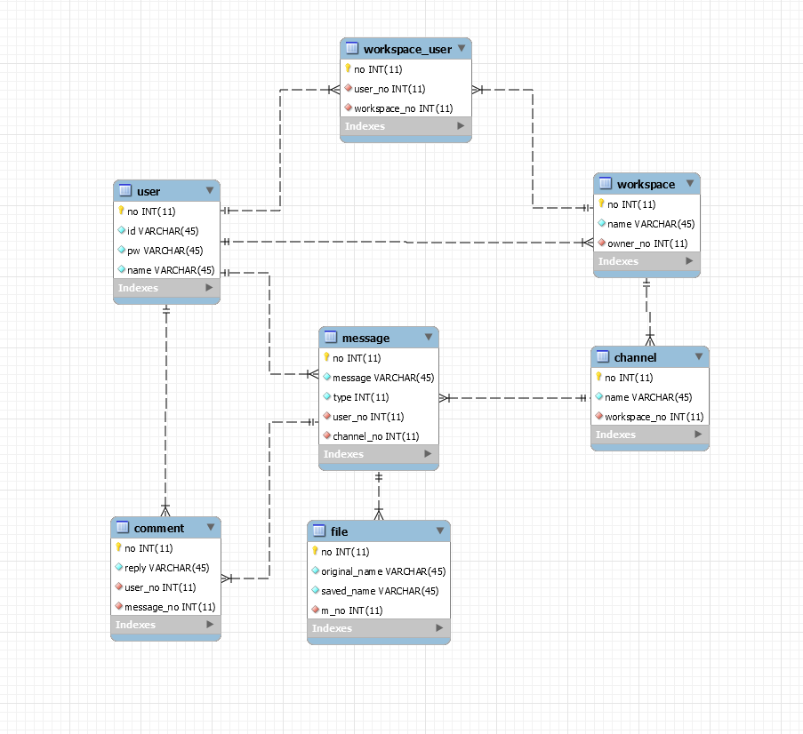

# AIOW
실시간 소켓 통신을 이용한 협업 프로그램입니다.

## 주요 기능
1. 실시간 채팅 시스템
2. 파일 업로드/다운로드
3. 사용자
    - 로그인, 회원가입
    - Workspace에 사용자 초대, Channel 생성

## 적용 기술
- Node.js/Express.js
- React.js
- MySQL
- WebSocket(socket.io)

## Database
